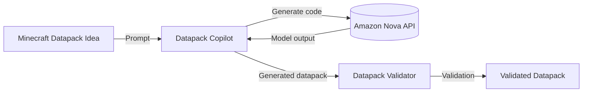

# Minecraft Datapack Copilot

Quickly build functional minecraft datapacks with AWS Nova.


## Architecture



## Roadmap

- [ ] How do we use the AWS Nova API text in text out - @kyle-parker-1500
- [ ] How do we verify the output for the datapack

## Setup

```bash
uv sync
uv run main.py
```

## Validate Datapack

Use `validate.py` to check if a datapack is correct.

Correct datapacks look like this:


Incorrect datapacks look like this:


## Get API Key


