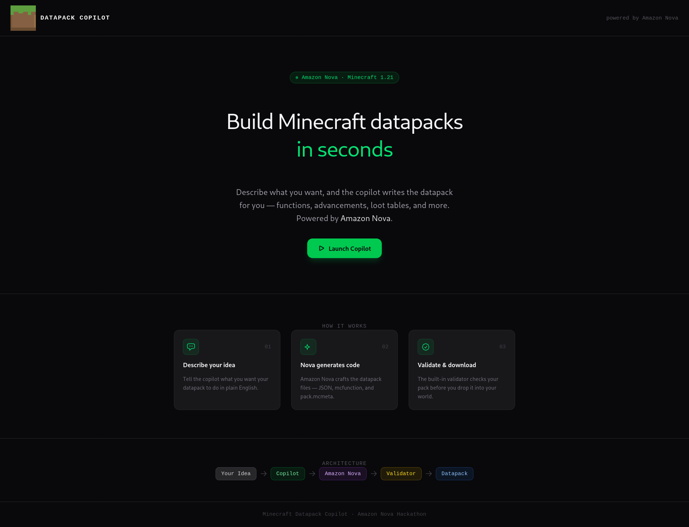
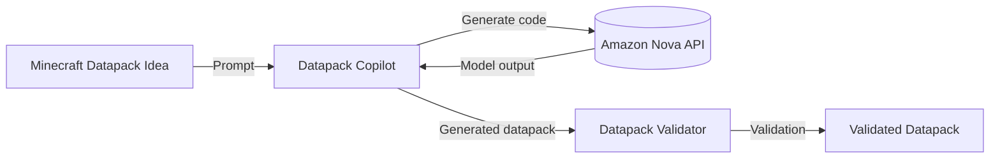

# Minecraft Datapack Copilot

Quickly build functional minecraft datapacks with [Amazon Nova](https://nova.amazon.com).


#### Elevator Pitch:

Use Amazon Nova to build functional minecraft datapacks. It's inaccessible for most Minecraft players to write datapacks by themselves, and this makes it easy!

## Example



## Technologies

[Amazon Nova](https://nova.amazon.com/) :star:, Python, Vite, React.js, Tailwind

## Architecture



## Roadmap

- [x] How do we use the AWS Nova API text in text out - @kyle-parker-1500
- [x] How do we verify the output for the datapack - @JakeRoggenbuck
- [x] Chat interface frontend @kyle-parker-1500

## Inspiration

We often want specific Minecraft data packs but weren't sure how to make them until recently. More importantly, it's inaccessible for most Minecraft players to write datapacks by themselves, and this makes it easy!

## What it does

Automatically generate valid Minecraft data packs. Data packs are small configuration files that enable custom gameplay. These data packs can vastly improve game play experience for users, but Minecraft doesn't offer an easy way to build them out for most players.

## How we built it

We used Amazon Nova as the intelligence for generating our data pack information. We then made a server in Python that requested the Amazon Nova API to generate the Minecraft config files needed to make the data packs work.

## Challenges we ran into

Matching an exact specification for what comprises a data pack is difficult. It was also difficult to translate generated code into actions that made file operations. Getting valid syntax is always hard, especially when the spec if not exact.

## Accomplishments that we're proud of

We built a validator that basically fixes the issue with incorrect data pack syntax, because we can feed the validators output of warnings and error into Amazon Nova to make corrections until the data pack is valid. We also made the chat interface very easy to use. Since Amazon Nova is very fast, it's able to help you build out a custom data pack effortlessly.

## What we learned

We learned how to make corrective feedback loops to ensure correctness of LLM output. We also learned how to use the Amazon Nova.

## What's next for Minecraft Datapack Copilot

We plan to generalize this idea to entire mod packages, which have a much larger scope and complexity.

## Setup

```bash
uv sync
uv run main.py
```

## Validate Datapack

Use `validate.py` to check if a datapack is correct.

Correct datapacks look like this:


Incorrect datapacks look like this:


## Get API Key


## Datapack Chat


